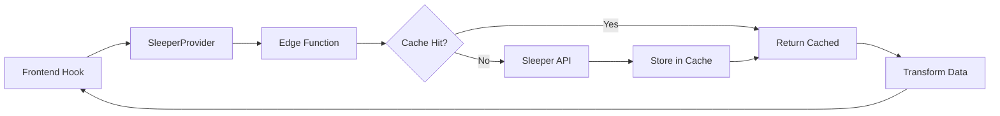

# Sleeper API Architecture

## Overview

This document describes the architecture of the Sleeper API integration, which provides NFL player data, statistics, and projections for the fantasy football application.

## Architecture Components

### 1. Edge Function Proxy (`sleeper-proxy`)

The Edge Function acts as a proxy between the frontend and the Sleeper API, providing:

- **Caching**: Reduces API calls by >90% with TTL-based expiration
- **Rate Limiting Protection**: Circuit breakers prevent cascading failures
- **Retry Logic**: Exponential backoff with jitter for transient failures
- **Observability**: Metrics tracking for monitoring and optimization

#### Endpoints

- `/state` - Get current NFL state (week, season, etc.)
- `/players` - Get all NFL players with metadata
- `/stats` - Get weekly statistics for players
- `/projections` - Get weekly projections for players
- `/health` - Health check and metrics endpoint

#### Configuration

```typescript
const TTL_CONFIG = {
  '/state': 300,        // 5 minutes
  '/players': 86400,    // 24 hours
  '/stats': 1800,       // 30 minutes
  '/projections': 1800, // 30 minutes
}
```

### 2. Provider Abstraction Layer

The provider layer abstracts data source implementations, allowing for easy switching between providers.

#### FantasyProvider Interface

```typescript
interface FantasyProvider {
  getNFLState(): Promise<ProviderResponse<NFLState>>
  getAllPlayers(): Promise<ProviderResponse<PlayersMap>>
  getWeeklyStats(season, week, seasonType): Promise<ProviderResponse<StatsMap>>
  getWeeklyProjections(season, week, seasonType): Promise<ProviderResponse<ProjectionsMap>>
  // ... additional methods
}
```

#### SleeperProvider Implementation

The `SleeperProvider` class implements the `FantasyProvider` interface using the Edge Function proxy.

### 3. Database Schema

#### API Cache Table

```sql
CREATE TABLE api_cache (
  key TEXT PRIMARY KEY,           -- SHA-256 hash of request
  value JSONB NOT NULL,           -- Cached response
  expires_at TIMESTAMPTZ NOT NULL, -- TTL expiration
  created_at TIMESTAMPTZ
);
```

#### API Metrics Table

```sql
CREATE TABLE api_metrics (
  id BIGSERIAL,
  ts TIMESTAMPTZ,
  endpoint TEXT,
  status INTEGER,
  cache_hit BOOLEAN,
  latency_ms INTEGER,
  error TEXT,
  metadata JSONB
) PARTITION BY RANGE (ts);
```

#### Player Cross-Reference IDs

Added to the `players` table for multi-provider support:

- `gsis_id` - NFL Game Statistics ID
- `sportradar_id` - Sportradar ID
- `espn_id` - ESPN ID
- `yahoo_id` - Yahoo Fantasy ID
- `rotowire_id` - Rotowire ID
- `fantasypros_id` - FantasyPros ID
- `pfr_id` - Pro Football Reference ID

### 4. Frontend Hooks

#### New Provider-Based Hooks

- `useNFLState()` - Get current NFL state
- `useNFLPlayers()` - Get all players
- `useWeeklyStats(season, week)` - Get weekly stats
- `useWeeklyProjections(season, week)` - Get projections
- `useProviderHealth()` - Monitor provider health

#### Backward Compatibility

Old hooks are maintained as aliases:
- `useSleeperNFLState` → `useNFLState`
- `useSleeperPlayers` → `useNFLPlayers`
- etc.

## Data Flow



## Performance Optimizations

### Caching Strategy

1. **Edge Function Cache**: PostgreSQL-based with TTL
2. **React Query Cache**: Client-side caching with stale-while-revalidate
3. **Cross-Reference IDs**: Enable data correlation across providers

### Circuit Breaker Pattern

```typescript
const CIRCUIT_BREAKER_THRESHOLD = 5    // Failures before opening
const CIRCUIT_BREAKER_TIMEOUT = 60000  // 60 seconds recovery
const CIRCUIT_BREAKER_SUCCESS_THRESHOLD = 3 // Successes to close
```

### Retry Strategy

```typescript
function exponentialBackoff(attempt: number): number {
  const baseDelay = 1000  // 1 second
  const maxDelay = 30000  // 30 seconds
  const jitter = Math.random() * 1000
  return Math.min(baseDelay * Math.pow(2, attempt) + jitter, maxDelay)
}
```

## Security Considerations

### Row Level Security (RLS)

- Cache entries are protected by RLS policies
- Only authenticated users can read cache
- Only Edge Functions and service role can write

### CORS Configuration

```typescript
const ALLOWED_ORIGINS = [
  'http://localhost:8080',
  'https://your-domain.com'
]
```

### Authentication

Edge Function requires Supabase authentication token:

```typescript
headers: {
  'Authorization': `Bearer ${session?.access_token}`
}
```

## Monitoring & Observability

### Metrics Tracked

- Request count by endpoint
- Cache hit rate
- Response latency (avg, p95)
- Error rate
- Circuit breaker state

### Health Check Response

```json
{
  "status": "healthy",
  "timestamp": "2024-01-10T12:00:00Z",
  "metrics": {
    "requests_last_5m": 100,
    "cache_hit_rate": "75%",
    "error_rate": "0.5%",
    "avg_latency_ms": 45
  },
  "circuit_breakers": {
    "/players": { "state": "closed", "failures": 0 }
  }
}
```

## Migration Guide

### For Existing Code

1. Update imports:
```typescript
// Old
import { useSleeperNFLState } from '@/hooks/useSleeperAPI'

// New (both work)
import { useNFLState } from '@/hooks/useNFLDataAPI'
import { useSleeperNFLState } from '@/hooks' // Backward compatible
```

2. The API remains the same - no changes needed to component code

### For New Features

Use the new provider-based hooks:

```typescript
import { useNFLPlayers, useWeeklyStats } from '@/hooks'

function MyComponent() {
  const { data: players } = useNFLPlayers()
  const { data: stats } = useWeeklyStats(2024, 10)
  // ...
}
```

## Testing

### Unit Tests

- `SleeperProvider.test.ts` - Provider implementation tests
- `FantasyProvider.test.ts` - Base class and interface tests
- `useNFLDataAPI.test.tsx` - Hook integration tests

### Running Tests

```bash
npm test                    # Run all tests
npm test -- --coverage      # With coverage report
```

## Deployment

### Edge Function Deployment

```bash
npx supabase functions deploy sleeper-proxy
```

### Database Migration

```bash
npx supabase db push
```

### Environment Variables

Required for Edge Function:

- `SLEEPER_BASE_URL` - Sleeper API base URL (default: https://api.sleeper.app)
- `ALLOWED_ORIGINS` - Comma-separated list of allowed origins
- `SUPABASE_URL` - Your Supabase project URL
- `SUPABASE_SERVICE_ROLE_KEY` - Service role key for database access

## Future Enhancements

1. **Multi-Provider Support**: Add ESPN, Yahoo, FantasyPros providers
2. **Advanced Caching**: Implement cache warming and predictive fetching
3. **GraphQL Layer**: Add GraphQL endpoint for flexible queries
4. **WebSocket Support**: Real-time updates during games
5. **ML Predictions**: Integrate machine learning for projections